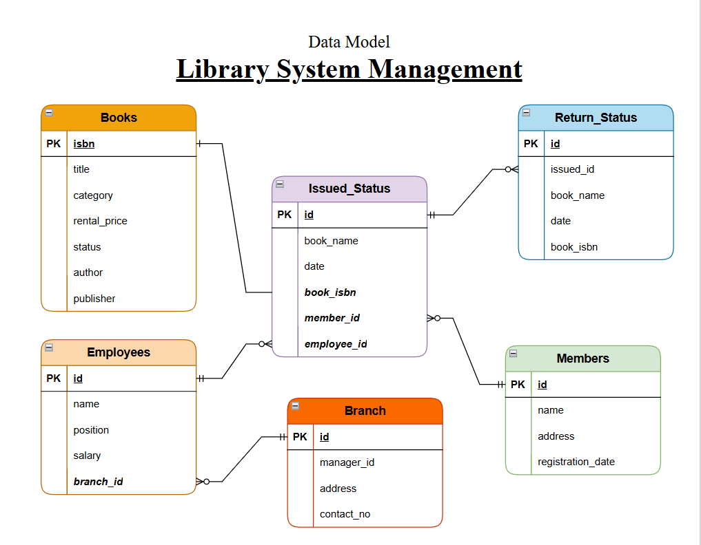

# Library System Management

This project demonstrates the implementation of a Library Management System using SQL. It includes creating and managing tables, performing CRUD operations, and executing advanced SQL queries. The goal is to showcase skills in database design, manipulation, and querying.

**Project Structure**
- [PostgreSQL Scripts Directory (.sql) /](sql_scripts)
- [Project Description (README File)](README.md)
- [Project Data Directory /](data/)
- [Project images Directory /](images/)

## Objectives

1. **Set up the Library Management System Database**: Create and populate the database with tables for branches, employees, members, books, issued status, and return status.
2. **CRUD Operations**: Perform Create, Read, Update, and Delete operations on the data.
3. **CTAS (Create Table As Select)**: Utilize CTAS to create new tables based on query results.
4. **Advanced SQL Queries**: Develop complex queries to analyze and retrieve specific data.

### 1. Set up the Library Management System Database
#### Dataset

- **Database Creation**: Created a database named `library_db`.
- **Table Creation**: Created tables for branches, employees, members, books, issued status, and return status. Each table includes relevant columns and relationships.

PostgreSQL query file for Database Setup and Table Creation [database_setup.sql](sql_scripts/database_setup.sql)

### 2. CRUD Operations
Solutions to these tasks can be found in [tasks_solutions_1.sql](sql_scripts/tasks_solutions_1.sql)

#### Tasks
- **Task 1**: Create a New Book Record
- **Task 2**: Update an Existing Member's Address
- **Task 3**: Delete a Record from the Issued Status Table
- **Task 4**: Retrieve All Books Issued by a Specific Employee
- **Task 5**: List Members Who Have Issued More Than One Book
- **Task 6**: (Create Summary Tables), Used CTAS to generate new tables based on query results - each book and total book_issued_cnt

### 3. Data Analysis & Findings

Solutions to these tasks can be found in [tasks_solutions_1.sql](sql_scripts/tasks_solutions_1.sql)

#### Tasks
- **Task 7: Retrieve All Books in a Specific Category
- **Task 8**: Find Total Rental Income by Category**:
- **Task 9**: List Members Who Registered in the Last 180 Days
- **Task 10**: List Employees with Their Branch Manager's Name and their branch details
- **Task 11**: Create a Table of Books with Rental Price Above a Certain Threshold
- **Task 12**: Retrieve the List of Books Not Yet Returned

### 5. Advanced SQL Operations
Solutions of these tasks can be found in [tasks_solutions_2.sql](sql_scripts/tasks_solutions_2.sql)

#### Tasks
- **Task 13: Identify Members with Overdue Books**. Write a query to identify members who have overdue books (assume a 30-day return period). Display the member's_id, member's name, book title, issue date, and days overdue.
- **Task 14: Update Book Status on Return**. Write a query to update the status of books in the books table to "Yes" when they are returned (based on entries in the return_status table).
- **Task 15: Branch Performance Report**. Create a query that generates a performance report for each branch, showing the number of books issued, the number of books returned, and the total revenue generated from book rentals.
- **Task 16: CTAS: Create a Table of Active Members**. Use the CREATE TABLE AS (CTAS) statement to create a new table active_members containing members who have issued at least one book in the last 2 months.
- **Task 17: Find Employees with the Most Book Issues Processed**. Write a query to find the top 3 employees who have processed the most book issues. Display the employee name, number of books processed, and their branch.
- **Task 18: Identify Members Issuing High-Risk Books**. Write a query to identify members who have issued books more than twice with the status "damaged" in the books table. Display the member name, book title, and the number of times they've issued damaged books.
- **Task 19: Stored Procedure**. Create a stored procedure to manage the status of books in a library system. Write a stored procedure that updates the status of a book in the library based on its issuance. The procedure should function as follows:
The stored procedure should take the book_id as an input parameter. The procedure should first check if the book is available (status = 'yes'). If the book is available, it should be issued, and the status in the books table should be updated to 'no'. If the book is not available (status = 'no'), the procedure should return an error message indicating that the book is currently not available.
- **Task 20: Create Table As Select (CTAS)**. Create a CTAS (Create Table As Select) query to identify overdue books and calculate fines.

## Reports

- **Database Schema**: Detailed table structures and relationships.
- **Data Analysis**: Insights into book categories, employee salaries, member registration trends, and issued books.
- **Summary Reports**: Aggregated data on high-demand books and employee performance.

## Conclusion

This project demonstrates the application of SQL skills in creating and managing a library management system. It includes database setup, data manipulation, and advanced querying, providing a solid foundation for data management and analysis.

  

