# Retail Sales Analysis

**Project Structure**
- [PostgreSQL Scripts File (.sql)](sql_scripts.sql)
- [Project Description (README File)](README.md)
- [Project Data Directory /](data/)
- [Project images Directory /](images/)

## Project Overview

**Project Title**: Retail Sales Analysis  
**Level**: Beginner  
**Database**: `Postgresql`

This project is designed to demonstrate SQL skills and techniques typically used by data data manager/analysts to explore, clean, and analyze retail sales data. The project involves setting up a retail sales database, performing exploratory data analysis (EDA), and answering specific business questions through SQL queries. This project is ideal for those who are starting their journey in data analysis and want to build a solid foundation in SQL.

## Objectives

1. **Set up a retail sales database**: Create and populate a retail sales database with the provided sales data.
2. **Data Cleaning**: Identify and remove any records with missing or null values.
3. **Exploratory Data Analysis (EDA)**: Perform basic exploratory data analysis to understand the dataset.
4. **Business Analysis**: Use SQL to answer specific business questions and derive insights from the sales data.

## Project Structure

### 1. Database Setup

- **Database Creation**: The project starts by creating a database named `sql_project`.
- **Table Creation**: A table named `retail_sales` is created to store the sales data. The table structure includes columns for transaction ID, sale date, sale time, customer ID, gender, age, product category, quantity sold, price per unit, cost of goods sold (COGS), and total sale amount.
- **Table Population**: After creating table we populate it with data containing in a csv file

*Dataset Overview*:

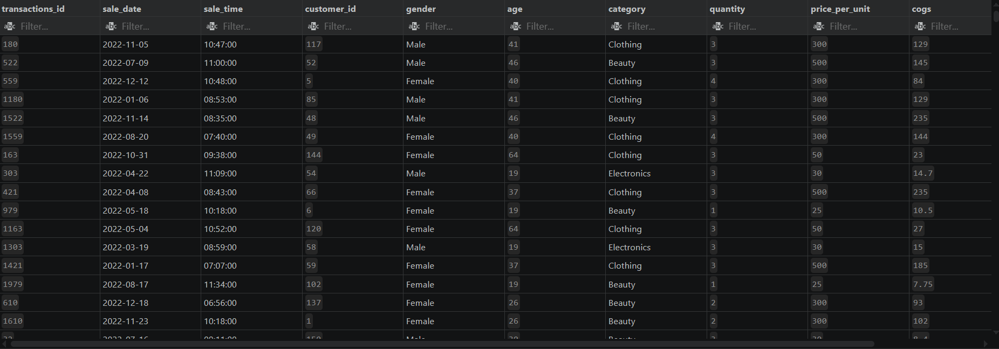

### 2. Data Exploration & Cleaning

- **Record Count**: Determine the total number of records in the dataset.
- **Customer Count**: Find out how many unique customers are in the dataset.
- **Category Count**: Identify all unique product categories in the dataset.
- **Null Value Check**: Check for any null values in the dataset and delete records with missing data.

```sql
SELECT COUNT(*) FROM retail_sales;
SELECT COUNT(DISTINCT customer_id) FROM retail_sales;
SELECT DISTINCT category FROM retail_sales;

SELECT * FROM retail_sales
WHERE 
    sale_date IS NULL OR sale_time IS NULL OR customer_id IS NULL OR 
    gender IS NULL OR age IS NULL OR category IS NULL OR 
    quantity IS NULL OR price_per_unit IS NULL OR cogs IS NULL;

DELETE FROM retail_sales
WHERE 
    sale_date IS NULL OR sale_time IS NULL OR customer_id IS NULL OR 
    gender IS NULL OR age IS NULL OR category IS NULL OR 
    quantity IS NULL OR price_per_unit IS NULL OR cogs IS NULL;
```

### 3. Data Analysis & Findings

Queries

1. Retrieve all columns for sales made on *2022-11-05*
2. Retrieve all transactions where the category is 'Clothing' and the quantity sold is more than 4 in the month of Nov 2022
3. Calculate the total sales for each category
4. Find the average age of customers who purchased items from the 'Beauty' category
5. Find all transactions where the total sale is greater than 1000
6. Find the total number of transactions (transaction_id) made by each gender in each category.
7. Calculate the average sale for each month. Find out best selling month in each year.
8. Find the top 5 customers based on the highest total sales
9. Find the number of unique customers who purchased items from each category.
10. Creae each shift and number of orders (ex: Morning <= 12, Afternoon Between 12 & 17, Evening > 17)

---

### The following SQL queries were developed to answer specific business questions

1.*Retrieve all columns for sales made on 2022-11-05*

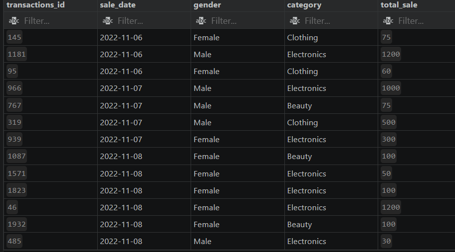

2.*Retrieve all transactions where the category is 'Clothing' and the quantity sold is more than 4 in the month of Nov-2022*

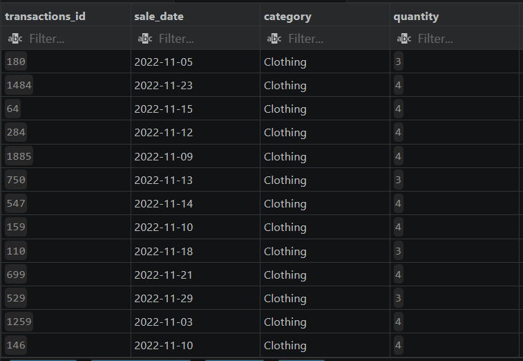

3.*Calculate the total sales (total_sale) for each category.*

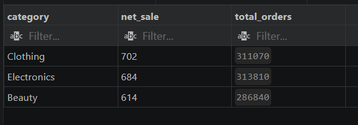

4.*Find the average age of customers who purchased items from the 'Beauty' category.*

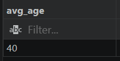

5.*Find all transactions where the total_sale is greater than 1000.*:

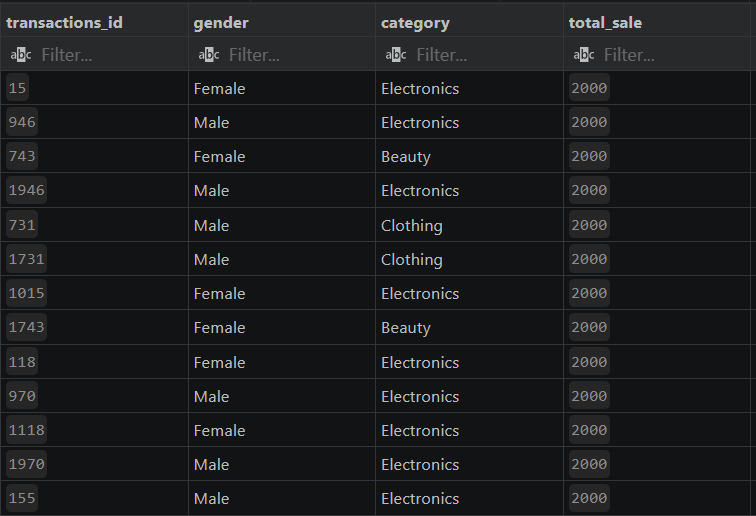

6.*Find the total number of transactions (transaction_id) made by each gender in each category.*

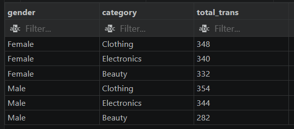

7.*Calculate the average sale for each month. Find out best selling month in each year*

Fisrt we query the average sale of each month in each year

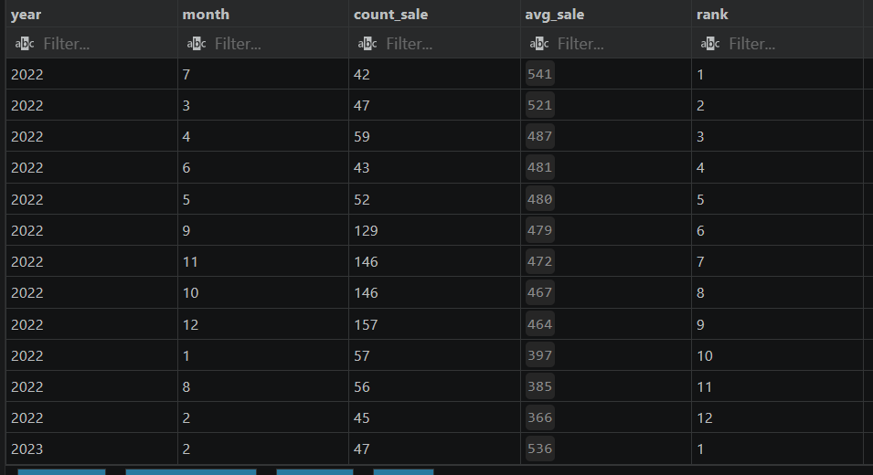

Then we select the top sales month of each year

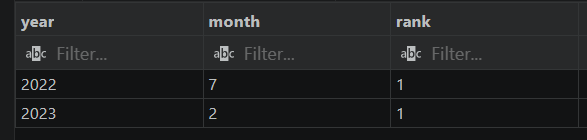

8.*Find the top 5 customers based on the highest total sales*

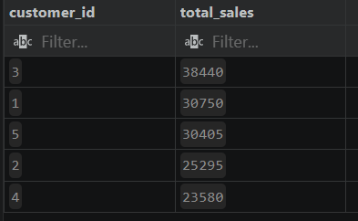

9.*Find the number of unique customers who purchased items from each category.*

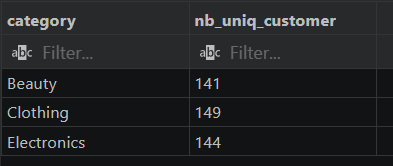

10.*Create each shift and number of orders (Example Morning <12, Afternoon Between 12 & 17, Evening >17)*

First we select query each sale time and create shift column for each sales time

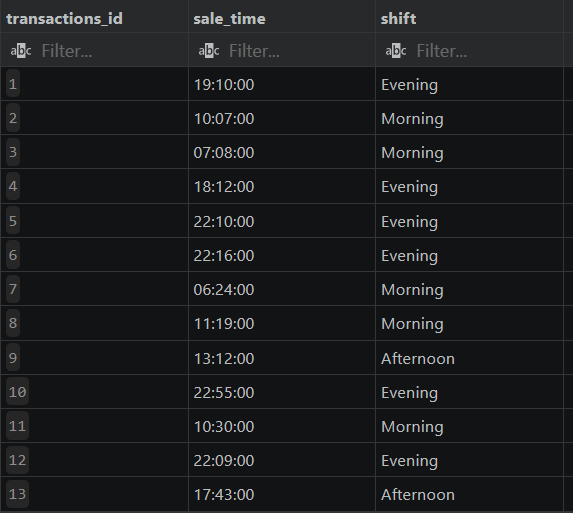

Then we group and count by shift column

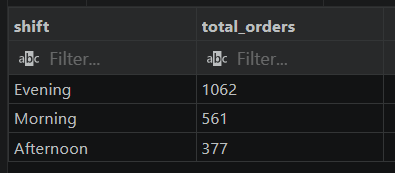

## Findings

- **Customer Demographics**: The dataset includes customers from various age groups, with sales distributed across different categories such as Clothing and Beauty.
- **High-Value Transactions**: Several transactions had a total sale amount greater than 1000, indicating premium purchases.
- **Sales Trends**: Monthly analysis shows variations in sales, helping identify peak seasons.
- **Customer Insights**: The analysis identifies the top-spending customers and the most popular product categories.

## Reports

- **Sales Summary**: A detailed report summarizing total sales, customer demographics, and category performance.
- **Trend Analysis**: Insights into sales trends across different months and shifts.
- **Customer Insights**: Reports on top customers and unique customer counts per category.

## Conclusion

This project serves as a comprehensive introduction to SQL for data analysts, covering database setup, data cleaning, exploratory data analysis, and business-driven SQL queries. The findings from this project can help drive business decisions by understanding sales patterns, customer behavior, and product performance.


## Author - Walkao Adamou

This project is part of my portfolio, showcasing the SQL skills essential for data analyst roles. If you have any questions, feedback, or would like to collaborate, feel free to get in touch!

Thank you for your support, and I look forward to connecting with you!
